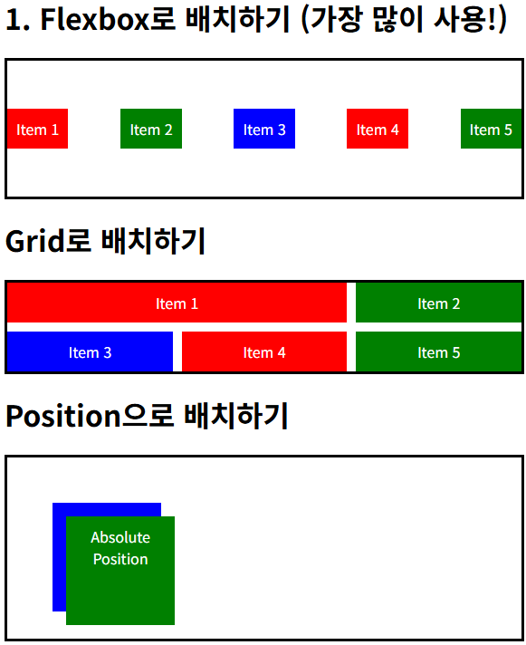
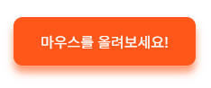

# CSS
CSS : Cascading Style Sheets : 웹 페이지의 스타일과 디자인을 정의하는 스타일시트 언어  

&nbsp;

## CSS 적용 방법
선택자(Selector)를 사용하여 적용  

- 태그에 직접 작성하는 인라인 스타일
- head 안에 style 태그로 작성하는 내부 스타일 시트
- 별도의 .css 파일을 연결하는 외부 스타일 시트 (link 태그 사용)

### CSS 기본 문법
```html
선택자 {
    속성: 값;
}
```

### 선택자 종류
- **전체 선택자** : *****
- **태그 선택자** : **HTML 태그 이름**을 그대로 사용  
- **클래스 선택자** : **점(.)**으로 시작. 여러 요소에 '별명'을 붙여 그룹으로 꾸밀 때 사용
- **id 선택자** : **샵(#)**으로 시작. 페이지에서 단 하나뿐인 요소에 이름표 붙일 때 사용
- **후손 선택자** : **띄어쓰기**로 구분. 특정 요소 안에 있는 모든 후손 선택
- **자손 선택자** : **> 기호**로 구분. 특정 요소의 바로 아래 자식만 선택
- 속성 선택자 : 특정 속성이나 속성값을 가진 요소를 선택
- 인접 형제 선택자 : 바로 뒤에 이어지는 형제 요소를 선택

우선순위 : 인라인 > id > 클래스 > 태그

### 인라인 스타일
태그에 직접 적용
```html
<p style="color: green; font-style: italic;">이 문단은 CSS를 이용해 수업 중에 직접 꾸며볼 예정입니다.</p>
```

### 내부 스타일 시트
head 안 style 태그로 적용
```html
<style>
    /* 태그 선택자 : HTML 태그 이름을 그대로 사용 */
    h2 {
        color: red;
    }

    /* 클래스 선택자 : 점(.)으로 시작 */
    .highlight-text {
        background-color: aqua;
    }

    /* id 선택자 : 샵(#)으로 시작 */
    #blue-text {
        color: blue;
    }
    
    /* 후손 선택자 : 띄어쓰기로 구분 */
    #lecture-list li {
        font-weight: bold;
    }
    
    /* 자손 선택자 : > 기호로 구분. 특정 요소의 바로 아래 자식만 선택 */
    body > p {
        font-size: 20px;
    }

    /* 속성 선택자 : 특정 속성이나 속성값을 가진 요소를 선택 */
    input[type="text"] {
        border: 2px solid orange;
    }

    /* 인접 형제 선택자 : 바로 뒤에 이어지는 형제 요소를 선택 */
    /* 체크된 요소의 label 요소에 적용 */
    input[type="radio"]:checked + label {
        font-weight: bold;
        color: blueviolet;
    }
</style>
```

### 외부 스타일 시트
별도의 css 파일 사용
```html
<head>
		<!-- 스타일 시트 경로 -->
    <link rel="stylesheet" href="style.css">
</head>
```

&nbsp;

## CSS 사용
### 글자 꾸미기
```html
<!-- 외부 폰트 적용 -->
<!-- https://fonts.google.com/?lang=ko_Kore -->
<link rel="preconnect" href="https://fonts.googleapis.com">
<link rel="preconnect" href="https://fonts.gstatic.com" crossorigin>
<link href="https://fonts.googleapis.com/css2?family=Bagel+Fat+One&display=swap" rel="stylesheet">

<style>
    body {
        font-family: "Bagel Fat One", system-ui;
        line-height: 1.8;
    }
    
    h1 {
        color: rgb(85, 20, 20);
        font-size: 40px;
        /* 글자 굵기 */
        font-weight: 900;
        /* h1 자체가 이동한게 아니라 h1 영역(블럭 요소) 안의 글자를 가운데로 위치 */
        text-align: center;
    }
</style>
```

### 박스 꾸미기
```html
<style>
    .box {
        background-color: bisque;

        /* 기본적으로 박스 모델 안에 들어가는 컨텐츠 크기 */
        /* 컨텐츠 크기 바깥으로 padding 이 들어감 > 컨텐츠 크기 정해진 상태로 padding 을 늘리면 border 가 넓어진다 */
        width: 300px;
        height: 150px;

        border: 2px dashed green;
        padding: 20px;
        margin: 30px;

        /* 위에 설정한 사이즈를 border 까지 포함한 사이즈로 변경 옵션 : 디폴트는 content-box */
        /* 크기 계산이 쉬워짐 */
        box-sizing: border-box;
    }

    .rounded-box {
        background-color: blueviolet;
        color: aliceblue;
        padding: 10px;
        margin: 10px;

        border-radius: 15px;
        /* x축, y축, 번짐 정도, 그림자색 */
        box-shadow: 10px 10px 15px rgba(141, 6, 119, 0.5);
    }

    .responsive-box {
        background-color: chartreuse;
        width: 90%;
        margin: 30px auto; /* 위아래 30px, 좌우 가운데 정렬 */
        
        max-width: 700px;
        min-width: 300px;
    }
</style>
```

### 레이아웃 꾸미기
```html
<head>
    <style>
        .container {
            border: 3px solid black;
        }
        .item {
            color: white;
            padding: 10px;
            text-align: center;
        }
        .red {
            background-color: red;
        }
        .green {
            background-color: green;
        }
        .blue {
            background-color: blue;
        }
        .flex-container {
            /* div 디폴트 : block */
            /* flex : 컨텐츠 크기에 맞춰 영역 크기 조절로 추정. 한 방향으로 요소를 배치할 때 많이 사용 */
            display: flex;

            /* 주축 방향 정렬(보통 가로) - space-between 요소들 사이에 요소만큼 비움, space-around : 양 끝에도 여백이 생김 */
            justify-content: space-between;

            height: 150px;
            /* 교차축 방향 정렬(보통 세로) */
            align-items: center;

            /* 공간이 부족하면 다음줄로 내려가는 옵션 */
            flex-wrap: wrap;
        }
        .grid-container {
            display: grid;
            
            /* 사용 가능한 공간을 1:1:1 비율로 나눈 3개의 열을 만듦 */
            grid-template-columns: 1fr 1fr 1fr;
            
            /* 요소들 간의 간격 */
            gap: 10px;
        }
        /* grid-container 클래스 하위 클래스 item 중 첫번째 자식 */
        .grid-container .item:first-child {
            /* 요소들 시작부터 사이까지의 간격을 1번 부터 숫자로 취급했을 때 1~3번 까지 두 칸 차지 의미 */
            grid-column: 1 / 3;
        }
        .position-container {
            /* relative : 현재 요소를 '위치 기준점'으로 만든다. 자식들의 기준점이 되고 자식도 position 이 필요. */
            position: relative;
            height: 200px;
        }
        .position-container .blue {
            /* relative 한 부모를 위치 기준점으로 잡고 absolute 위치를 잡는다. */
            /* absolute 가 적용된 요소의 자리를 다른 요소들이 비워두지 않기 때문에 원하는 위치에 겹쳐 배치핧 수 있지만,
            남용하면 화면 구조가 흐트러질 수 있기에 필요한 경우에만 사용 */
            position: absolute;
            top: 50px;
            left: 50px;
            
            width: 100px;
            height: 100px;
        }
        .position-container .green {
            position: absolute;
            top: 65px;
            left: 65px;

            width: 100px;
            height: 100px;
        }
    </style>
</head>
<body>
    <h1>1. Flexbox로 배치하기 (가장 많이 사용!)</h1>
    <div class="container flex-container">
        <div class="item red">Item 1</div>
        <div class="item green">Item 2</div>
        <div class="item blue">Item 3</div>
        <div class="item red">Item 4</div>
        <div class="item green">Item 5</div>
    </div>

    <h1>Grid로 배치하기</h1>
    <div class="container grid-container">
        <div class="item red">Item 1</div>
        <div class="item green">Item 2</div>
        <div class="item blue">Item 3</div>
        <div class="item red">Item 4</div>
        <div class="item green">Item 5</div>
    </div>

    <h1>Position으로 배치하기</h1>
    <div class="container position-container">
        <div class="item blue">Absolute Position</div>
        <div class="item green">Absolute Position</div>
    </div>
</body>
```


### 인터랙션 꾸미기
```html
<head>
    <style>
        .button {
            /* <a> 태그에 inline-block 을 적용하면 영역처럼 사용 가능  */
            display: inline-block;

            padding: 15px 30px;
            background-color: coral;
            margin: 20px;
            color: black;
            border-radius: 10px;

            /* <a> 태그 밑줄 없애는 기능 */
            text-decoration: none;

            /* 스타일이 바뀔 때 부드럽게 바뀌는 속성 */
            transition: all 0.3s ease;
        }
        /* button 클래스 선택자의 hover 기능. hover: 마우스 커서를 올렸을 때의 상태 */
        .button:hover {
            background-color: rgb(255, 68, 0);
            color: white;

            /* 요소의 모양 변형 rotate, scale 같은 옵션 존재 */
            /* 아래 옵션은 Y축 이동 */
            transform: translateY(-3px);

            box-shadow: 0 8px 10px rgba(255, 68, 0, 0.6);

            /* 0에 가까울수록 투명, 1에 가까울수록 불투명 */
            opacity: 0.9;
        }
        /* active : 요소를 클릭하고 있는 동안의 상태 */
        .button:active {
            /* 기존 위치 기준으로 y의 위치 */
            transform: translateY(0px);
            box-shadow: 0 1px 10px rgba(255, 68, 0, 0.6);
        }
    </style>
</head>
<body>
    <h1>마우스 반응과 부드러운 효과</h1>
    <p>가상 클래스 선택자(:hover)와 트랜지션(transition)을 이용해 인터랙션 할 수 있다.</p>

    <a href="#" class="button">마우스를 올려보세요!</a>
</body>
```
