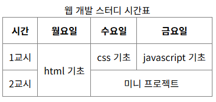
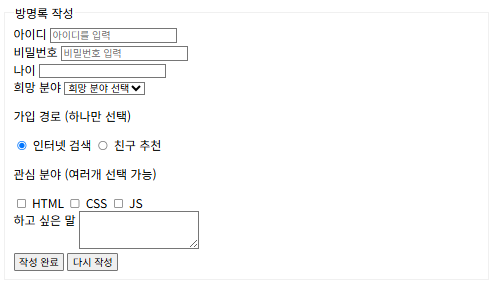

# VS Code 설정
## 환경설정
1. 설정 오픈
2. Editor > Inline Suggest: Enabled 체크 해제 (자동 코딩 방지)
3. Extensions > Emmet > Trigger Expension On Tab 체크 (Tab 키로 태그 자동 완성)

&nbsp;

## 확장 프로그램
- Live Server : Enable(Workspace) 를 누르고 오른쪽 아래 Go Live 를 누르면 저장한 변경사항이 바로 반영되는 웹 페이지 오픈

&nbsp;

## 단축키
Ctrl + , : 설정 오픈  
Ctrl + Enter : 아래줄로 내려오기  
Ctrl + / : 주석 자동완성  
Alt + Shift + 방향키 : 해당 방향으로 한 줄 복사  
ul>li*4 + Tab : ul 안 쪽에 li 4개 리스트 만들어줌  
div + Tab : div 태그 자동 완성

&nbsp;

# HTML
HTML : HyperText Markup Language  


마크 업 (태그) : 문서의 논리적인 구조를 정의하고, 출력장치에 어떠한 형태로 보여질 것인지를 지시하는 역할  


마크 업 언어 : 마크 업(태그)의 형식과 규칙을 정의한 언어  

&nbsp;

## HTML 기본 구조
### HTML 구성 요소
- 태그 (Tag) : <> 로 묶인 명령어
- 요소 (Element) : 시작태그와 종료태그로 이루어진 모든 명령어. 하나의 HTML 문서는 요소들의 집합
- 속성 (Attribute) : 요소의 시작태그에만 사용. 명령어 구체화 역할. 공백으로 구분하여 여러 개의 속성을 사용 가능
- 변수/속성값 (Argument) : 속성이 가지는 값. 값 입력 시 "" 혹은 '' 이용

### HTML 기본 구조
```html
<!doctype html> 문서유형
<html lang="ko">
	<head>
		문서의 정보 <title>, <meta>, <link>, <style>, <script>
	</head>
	<body>
		헤드를 제외한 모든 화면에 출력하는 내용
	</body>
</html>
```

&nbsp;

## HTML 태그
### 텍스트
```html
<h1>제목</h1>

<hr><!-- 구분선 -->

<br><!-- 줄바꿈 -->

<pre>쓴 모양을 그대로 보여주는 태그 (주로 코드 표현시 사용)</pre>

<b>굵은 글씨</b>
<strong>중요한 내용</strong>

<i>기울인 글씨</i>
<em>강조하고 싶은 내용</em>

<mark>형광펜으로 칠한 것 처럼</mark>

<del>취소선</del>
```

### 목록
```html
<!-- 순서 없는 목록 ul : Unordered List -->
<ul>
    <li></li>
</ul>

<!-- 순서 있는 목록 ol : Ordered List -->
<ol>
    <li></li>
</ol>
```

### 표
```html
<!-- 표 전체를 감싸는 태그 -->
<table>
    <!-- caption : 표의 제목 또는 설명 -->
    <caption>웹 개발 스터디 시간표</caption>
    <!-- thead : 표의 제목 행들을 묶는 영역 -->
    <thead>
        <!-- tr : 표의 한 행 -->
        <tr>
            <!-- th : 표의 제목 셀-->
            <th>시간</th>
            <th>월요일</th>
            <th>수요일</th>
            <th>금요일</th>
        </tr>
        </thead>
        <tbody>
        <tr>
            <!-- td : 표의 각 셀 -->
            <td>1교시</td>
            <!-- 행 병합 -->
            <td rowspan="2">html 기초</td>
            <td>css 기초</td>
            <td>javascript 기초</td>
        </tr>
        <tr>
            <td>2교시</td>
            <!-- 열 병합 -->
            <td colspan="2">미니 프로젝트</td>
        </tr>
    </tbody>
</table>
```


### 미디어
```html
<h1>미디어로 페이지 꾸미기</h1>
<h2>이미지 넣기</h2>
<!-- alt 태그는 사진을 설명할 수 있는 설명 : 화면 낭독기, 엑스박스 -->


<!-- 사진을 하나로 묶는다 -->
<figure>
    
    <!-- 기본적으로 보이는 이미지 설명 -->
    <figcaption>한 송이의 꽃입니다.</figcaption>
</figure>

<h2>오디오 넣기</h2>
<audio src="sample/audio/major.mp3" controls></audio>

<h2>비디오 넣기</h2>
<video src="sample/video/video1.mp4" controls></video>
```

### 링크
```html
<h1>하이퍼링크로 페이지 연결하기</h1>

<h2>다른 웹사이트로 이동하기</h2>
<ul>
    <li><a href="https://www.google.com">구글로 이동</a></li>
    <!-- 새로운 탭으로 링크가 열림 -->
    <li><a href="https://www.naver.com" target="_blank">네이버로 이동</a></li>
</ul>

<h2>같은 폴더의 다른 파일로 이동하기</h2>
<ul>
    <li><a href="01_text-and-list.html">텍스트와 목록</a></li>
    <li><a href="02_table-and-media.html" target="_blank">표와 미디어</a></li>
</ul>

<h2>페이지 내부의 특정 위치로 이동하기</h2>
<p><a href="#guestbook" target="_blank">페이지 하단의 방명록으로 바로가기</a></p>
```

### 폼
```html
<h1>폼(Form)으로 사용자 정보 입력기</h1>
<!-- form 태그는 사용자가 입력한 데이터를 서버로 보내는 창구 역할 -->
<form action="#" method="post">
    <fieldset>
        <legend id="guestbook">방명록 작성</legend>
        <div>
            <!-- label for 속성으로 input id 를 연결하면 라벨을 눌러도 input 을 선택 가능하다 -->
            <label for="user-id">아이디</label>
            <!-- 서버에 보낼 때 key = name 이 된다. -->
            <input id="user-id" name="userId" type="text" placeholder="아이디를 입력">
        </div>
        <div>
            <label for="user-pw">비밀번호</label>
            <input id="user-pw" name="userPw" type="password" placeholder="비밀번호 입력">
        </div>
        <div>
            <label for="user-age">나이</label>
            <input id="user-age" name="userAge" type="number">
        </div>
        <div>
            <label for="user-track">희망 분야</label>
            <!-- 드롭다운 입력 요소 -->
                <select name="track" id="user-track" required>
                <option value="none" selected>희망 분야 선택</option>
                <option value="frontend">프론트엔드</option>
                <option value="backend">백엔드</option>
                <option value="ai">AI</option>
                </select>
        </div>
        <div>
            <p>가입 경로 (하나만 선택)</p>
            <!-- name 이 같기에 선택한 것들 중 하나만 선택된다 -->
            <input type="radio" id="route-internet" name="route" value="internet" checked>
            <label for="route-internet">인터넷 검색</label>
            <input type="radio" id="route-friend" name="route" value="friend">
            <label for="route-friend">친구 추천</label>
        </div>
        <div>
            <p>관심 분야 (여러개 선택 가능)</p>
            <input type="checkbox" id="hobby-html" name="hobby" value="html">
            <label for="hobby-html">HTML</label>
            <input type="checkbox" id="hobby-css" name="hobby" value="css">
            <label for="hobby-css">CSS</label>
            <input type="checkbox" id="hobby-js" name="hobby" value="js">
            <label for="hobby-js">JS</label>
        </div>
        <div>
            <label for="memo" style="vertical-align: top;">하고 싶은 말</label>
            <textarea name="memo" id="memo" rows="3"></textarea>
        </div>
        <div>
            <!-- 폼 내용을 전성 -->
            <button type="submit">작성 완료</button>
            <!-- 폼 내용 리셋 -->
            <button type="reset">다시 작성</button>
        </div>
    </fieldset>
</form>
```


### 영역
```html
<h1>영역을 나누는 기본 태그 : div 와 span</h1>

<h2>div 태그(블럭 레벨 요소)</h2>
<!-- division, 영역을 나눈다는 뜻. 한 줄을 통째로 차지 -->
<div>첫 번째 div 요소입니다.</div>
<div>두 번째 div 요소입니다.</div>

<h2>span 태그(인라인 요소)</h2>
<!-- span : 특정 범위를 지정한다는 뜻. 콘텐츠 크기만큼의 공간만 차지 -->
<span>첫 번째 span 영역입니다.</span>
<span>두 번째 span 영역입니다.</span>

<hr>

<h2>의미를 담아 영역 나누기 : 시맨틱 태그</h2>
<!-- header : 페이지나 특정 구역의 머리말 (로고, 제목, 메뉴) -->
<header>
    <h1>My Profile Page</h1>
    <nav>
        <a href="#intro" target="_blank">소개</a>
        <a href="#skills" target="_blank">보유 기술</a>
    </nav>
</header>
<!-- main 태그는 이 문서의 핵심 내용을 담는 영역이다. -->
<main>
    <section id="intro">
        <h2>소개</h2>
        <p>안녕하세요! 예비 개발자 홍길동입니다!</p>
    </section>
    <section id="skills">
        <h2>보유 기술</h2>
        <ul>
            <li>HTML</li>
            <li>CSS</li>
        </ul>
    </section>
</main>
<footer>
    <p>Copyright 2026 Gildong Hong.</p>
</footer>
```

### 의미가 있는 태그
의미가 있는 태그는 SEO 최적화를 이룬다.
```html
<header></header>
<main>
    <section></section>
</main>
<footer></footer>
```