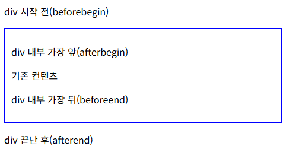

# DOM (Document Object Model)
- DOM : 문서 객체 모델. 브라우저가 HTML 코드(문서)를 보고 객체로 표현해 놓은 구조.
- 렌더링 : 웹 페이지를 그리는 과정
- 파싱 : 구문 분석
- document : 브라우저가 자동으로 제공해주는 객체. HTML 문서 전체를 자바스크립트로 다루기 위한 출발점. (Window 안에 현재 문서를 대표하는 document, 그 아래에 html head 등이 있다.)

#### 자주 사용하게 되는 키워드
```javascript
// 요소 찾기
document.getElementId('id값');

// 요소의 내부 텍스트 사용
요소.textContent;

// 요소의 프로퍼티 가져오기 (ex) value)
요소.value;

// javascript 로 요소 추가/삭제
const $새요소 = document.createElement('태그명');
부모요소.appendChild($새요소);
부모요소.removeChild($삭제할요소);

// css 적용할 클래스명 추가
요소.classList.add('삽입하고 싶은 클래스명');

// 인라인 스타일 적용 (케밥 케이스(css) > 카멜 케이스)
요소.style.css속성 = 값;
```

## 요소 선택
자바스크립트를 작성할 때는 <script></script> 태그 안에 작성
- **querySelector(id 나 class 등 css 선택자)** : 'CSS 선택자'에 맞는 '첫번째 요소를 하나' 가져온다.
    ```html
    <script>
        // DOM 요소가 들어있는 변수명은 $로 많이 시작한다.
        const $apple = document.querySelector('#apple'); // id 가 apple 인 요소를 가져온다.
        console.log($apple);
        $apple.style.fontWeight = 'bold';
    </script>
    ```
- **querySelectorAll(css 선택자)** : 'CSS 선택자'에 맞는 '모든 요소'를 NodeList로 찾아온다.  
    NodeList : 찾아온 순간의 상태를 기본적으로 유지
    ```html
    <script>
        const $fruits = document.querySelectorAll('.fruit'); // class 가 fruit 인 요소를 전부 가져온다.
        console.log($fruits);
        
        $fruits.forEach(item => {
            item.style.border = '1px solid blue';
        });
    </script>
    ```
- **getElementById(id값)** : id 값으로 요소를 하나 가져온다. 자주 사용됨
    ```html
    <p id="search-result" class="result">검색 결과가 여기에 표시됩니다.</p>
    <script>
        const $searchResult = document.getElementById("search-result");
    </script>
    ```
- **getElementsByClassName(class명)** : 무조건 클래스명으로 찾기에 . 은 넣지 않는다. HTMLCollection 목록으로 반환.  
    HTMLCollection : 변경사항이 바로바로 반영됨
    ```html
    <div class="box">
        <p class="text">첫 번째 문단</p>
        <p class="text">두 번째 문단</p>
        <p class="text">세 번째 문단</p>
    </div>

    <script>
        const $box = document.querySelector('.box');
        // $box 요소를 기준으로 자식들을 찾겠다.
        // getElementsByClassName(class 명) : 무조건 클래스명으로 찾기에 . 은 넣지 않는다.
        const $texts = $box.getElementsByClassName('text');
        
        // 순회하며 클래스 제거 시도
        // HTMLCollection 특징으로 인해 바로바로 변경된다.
        // 1. i 가 0 일 때 첫번째 문단의 텍스트를 지움 > 바로 반영이 되서 [두번째 문단, 세번째 문단] 의 리스트가 된다.
        // 2. i 가 1 일 때 변경된 리스트의 세번째 문단의 텍스트를 지움 > 그 후 조건식을 넘어서 반복 종료.
        for(let i = 0; i < $texts.length; i++) {
            $texts[i].classList.remove('text'); // 두 번째 문단 class 만 유지됨
        }
    </script>
    ```

&nbsp;

#### 일반 배열로 변환
HTTPCollection 은 변경을 실시간으로 반영하여 불안정하기에 배열로 변환해서 사용
- 스프레드 문법(…)을 사용하여 일반 배열로 변환
    ```html
    <div class="box">
        <p class="text2">첫 번째 문단</p>
        <p class="text2">두 번째 문단</p>
        <p class="text2">세 번째 문단</p>
    </div>

    <script>
        const $texts2 = document.getElementsByClassName('text2');

        // 스프레드 문법(...)을 사용하여 일반 배열로 변환
        const textArray = [...$texts2];
        
        textArray.forEach(item => {
            item.classList.remove('text2'); // 전부 class text2 가 삭제됨
        });
        
        console.log($texts2.length); // 0, 실시간으로 비어있음
        console.log(textArray.length); // 3, 고정된 배열이기에 삭제되진 않음
    </script>
    ```

&nbsp;

## 노드의 부모/자식/형제 요소 선택
```html
<h1>'HTML 가계도' 탐색하기</h1>
<pre>
    우리는 querySelector로 특정 요소를 찾은 뒤, 그 요소를 기준으로
    가족(부모, 자식, 형제) 요소를 찾아 나갈 수 있습니다.

    이때, 눈에 보이지 않는 '공백'이나 '줄바꿈' (텍스트 노드) 때문에 겪는 혼란을 피하기 위해
    요소만 필요한 경우에는 이름에 `Element`가 들어간 탐색 프로퍼티를 사용합니다.
    </pre>

<ul id="family">
    <!-- 이 주석과 줄바꿈도 노드입니다! -->
    <li id="me">나 (기준)</li>
    <li>나의 첫째 형제</li>
    <li>나의 둘째 형제</li>
</ul>
```
특정 하나를 찾으려할 경우, 없으면 주로 null 을 반환한다.

&nbsp;

### 자식 요소 반환
- childNodes : HTML 에서는 태그 외 줄바꿈이나 주석도 다 노드이기에 다 포함되서 나온다. NodeList 로 반환
- children : 모든 '자식 요소'들을 HTMLCollection 으로 반환 (텍스트 노드 제외 / 실질 태그 노드)
- firstElementChild : 첫 번째 자식 요소 반환
- lastElementChild : 마지막 자식 요소 반환
```javascript
const $me = document.getElementById("me");
const $family = document.getElementById('family');

// childNodes : HTML 에서는 태그 외 줄바꿈이나 주석도 다 노드이기에 다 포함되서 나온다. NodeList 로 반환
console.log($family.childNodes);

// children : 모든 '자식 요소'들을 HTMLCollection 으로 반환 (텍스트 노드 제외 / 실질 태그 노드)
const $children = $family.children;

// firstElementChild : 첫 번째 자식 요소 반환
const $first = $family.firstElementChild;
$first.style.color = 'red';

// lastElementChild : 마지막 자식 요소 반환
const $last = $family.lastElementChild;
```

&nbsp;

### 부모 요소 반환
- parentNode : 나의 부모 노드 반환
- parentElement
```javascript
// parentNode : 나의 부모 노드 반환
// HTML 요소를 기준으로 다룰 때는 parentElement 도 자주 사용
const $parent = $me.parentNode;
$parent.style.border = '1px solid blue';
```

&nbsp;

### 형제 요소 반환
- nextElementSibling : 나의 바로 다음 형제 요소 반환
- previousElementSibling : 나의 바로 이전 형제 요소 반환
```javascript
// nextElementSibling : 나의 바로 다음 형제 요소 반환
const $next = $me.nextElementSibling;

// previousElementSibling : 나의 바로 이전 형제 요소 반환
const $prev = $next.previousElementSibling;
```

&nbsp;

## 노드 조작
### nodeType
노드의 종류를 숫자로 알려준다. (1 : 요소, 3 : 텍스트, 9 : 문서)
```html
<div id="info-area">div 안의 텍스트</div>
<script>
    const $infoArea = document.getElementById('info-area'); // div 요소 노드
    const $textInside = $infoArea.firstChild; // 'div 안의 텍스트' 라는 텍스트 노드

    // nodeType : 노드의 종류를 숫자로 알려준다.(1 : 요소, 3 : 텍스트, 9 : 문서)
    console.log($infoArea.nodeType); // 1
    console.log($textInside.nodeType); // 3
</script>
```

&nbsp;

### nodeValue
```html
<h4>(1) 텍스트 노드의 값을 다루는 `.nodeValue`</h4>
<pre>
    `.nodeValue`는 오직 '텍스트 노드'의 값만 읽고 쓸 수 있습니다.
    '요소 노드' 자체에는 텍스트 정보가 없다고 판단하여 `null`을 반환하기 때문에,
    요소 전체의 텍스트를 다루려는 경우에는 자식 텍스트 노드를 먼저 찾아야 합니다.
    </pre>
<div id="value-area">nodeValue</div>
<script>
    const $valueArea = document.getElementById('value-area');
    const $valueText = $valueArea.firstChild;

    // 요소 노드 자체의 nodeValue 는 null 이다. 그렇기에 텍스트에 접근하려면 자식 노드를 한번 더 찾아와야한다.
    console.log($valueArea.nodeValue); // null

	// 텍스트를 바꾸려면, 자식인 '텍스트 노드'를 직접 찾아가야 한다.
    $valueText.nodeValue = 'nodeValue 로 변경 완료!!!';
</script>
```

&nbsp;

### textContent
문자열을 일반 텍스트로 처리한다. (안전)
```html
<div id="content-area">여기는 <b>굵은</b> 글씨가 있는 영역입니다.</div>

<script>
    const $contentArea = document.getElementById('content-area');
    // 요소 자체의 마크업이 아니라 요소와 자손 노드의 텍스트 내용을 가져온다.
    // 현재 요소와 그 안의 모든 자손 노드가 가진 텍스트를 모아서 반환
    console.log($contentArea.textContent); // 여기는 굵은 글씨가 있는 영역입니다.
    
    // 모든게 다 일반 문자열로 인식된다. (안전)
    $contentArea.textContent = 'textContent 로 쉽게 변경 완료!! <span>태그는?</span>';
</script>
```
- innerText : 화면에 렌더링되는 텍스트를 기준으로 하므로 CSS와 레이아웃의 영향을 받습니다.

&nbsp;

## DOM 조작과 추가
### innerHTML
문자열을 HTML 로 파싱한다. (편리하지만 사용자의 입력을 받을 때는 위험) (**XSS 공격 받을 위험**)

추가만 하고 싶을 때 += 같은 방식으로 추가하면 **기존을 전부 제거하고 추가한 내용이 포함된 새로운 전체 HTML 을 파싱하는 것**이기에 의도치 않은 동작이 일어날 수 있다.
```html
<div id="area1">
    <p>기존에 있던 내용입니다.</p>
</div>

<script>
    const $area1 = document.getElementById("area1");
    // innerHTML : 선택한 요소의 내부에 있는 html 을 다루는 프로퍼티
    console.log($area1.innerHTML); // <p>기존에 있던 내용입니다.</p>

    // 문자열을 html 로 인식하여 파싱하였다. (입력 값을 받는 방식으로 할 때는 주의!)
    $area1.innerHTML = '<ul><li>새로운 리스트 아이템</li></ul>';
    
    /**
	    $area1.innerHTML += '<ul><li>새로운 리스트 아이템</li></ul>';'
	    같은 방식으로 추가하면 기존을 전부 제거하고 추가한 내용이 포함된 새로운 전체 HTML 을 파싱하는 것이기에 의도치 않은 동작이 일어날 수 있다.
    */
    
    // 사용자 입력을 그대로 넣으면 XSS 공격에 취약하다.
    // 사용자가 입력한 값을 출력할 때는 기본적으로 textContent 를 우선으로 생각
    // $area1.innerHTML = ``;
</script>
```

&nbsp;

### insertAdjacentHTML
원하는 위치에 HTML 문자열을 파싱한 노드를 삽입  
**XSS 보안 위험은 동일하게 존재**  
메서드 키워드 참고 문서 : https://developer.mozilla.org/ko/docs/Web/API/Element/insertAdjacentHTML
```html
<!-- beforebegin -->
<div id="area2" style="border: 2px solid blue; padding: 10px;">
    <!-- afterbegin -->
    <p>기존 컨텐츠 </p>
    <!-- beforeend -->
</div>
<!-- afterend -->

<script>
    const $area2 = document.getElementById('area2');

    $area2.insertAdjacentHTML('beforebegin', '<p>div 시작 전(beforebegin)</p>');
    $area2.insertAdjacentHTML('afterbegin', '<p>div 내부 가장 앞(afterbegin)</p>');
    $area2.insertAdjacentHTML('beforeend', '<p>div 내부 가장 뒤(beforeend)</p>');
    $area2.insertAdjacentHTML('afterend', '<p>div 끝난 후(afterend)</p>');
</script>
```


&nbsp;

### 요소를 직접 생성 및 조합
```html
<ul id="drink-list">
    <li>커피</li>
</ul>

<script>
    const $drinkList = document.getElementById('drink-list');

    // 1. createElement 로  'li' 요소 제작
    const $newLi = document.createElement('li');

    // 2. textContent 로 텍스트를 넣는다.
    $newLi.textContent = '콜라';
    console.log($newLi); // <li>콜라</li>

    // 3. appendChild 로 리스트의 마지막 자식으로 조립
    $drinkList.appendChild($newLi);
    
    
    // DocumentFragment : 여러 요소를 효율적으로 추가
    const $fragment = document.createDocumentFragment(); // 임시 조립 공간
    ['사이다', '우유'].forEach(text => {
        const $li = document.createElement('li');
        $li.textContent = text;
        $fragment.appendChild($li); // 이시 공간에 먼저 조립
    });

    // 자식들을 fragment 에 모은 뒤 실제 DOM 에는 한 번에 추가
    $drinkList.appendChild($fragment);
</script>
```

&nbsp;

### 노드 삽입/이동/교체/삭제
- **노드 삽입 (insertBefore)** : 부모요소.insertBefore(삽입할 노드, 기준 노드); 부모 요소 밑에서 기준 노드 앞에 삽입할 노드 삽입
- **노드 이동 (appendChild)** : 부모요소.appendChild(삽입할 노드); 이미 존재하는 노드를 원하는 위치에 추가하면 자동으로 이전 위치에서 삭제되며 이동된다. 같은 노드는 중복으로 존재할 수 없다. (복제하고 싶으면 cloneNode 를 사용해야한다.)
- **노드 교체 (replaceChild)** : 부모요소.replaceChild(교체할 노드, 기존 노드);
- **노드 삭제 (removeChild, remove)** : 부모요소.removeChild(삭제할 노드); 삭제할노드.remove();
```html
<ul id="food-list">
    <li id="pasta">파스타</li>
    <li id="pizza">피자</li>
</ul>

<script>
    const $foodList = document.getElementById('food-list');
    const $drinkList2 = document.getElementById('drink-list');
    const $pasta = document.getElementById('pasta');
    const $pizza = document.getElementById('pizza');

    // 1. 노드 삽입 (insertBefore)
    const $newFood = document.createElement('li');
    $newFood.textContent = '스테이크';
    // 피자 앞에 스테이크(newFood) 삽입
    // 부모요소.insertBefore(삽입할 노드, 기준 노드);
    // 기준이 되는 $pizza 는 반드시 $foodList 의 자식 노드여야 한다.
    $foodList.insertBefore($newFood, $pizza);

    // 2. 노드 이동 (appendChild)
    // 이미 존재하는 '피자'를 drink-list 에 append 하면 같은 노드를 복사하지 않고 실제 위치를 이동시킨다. (food-list 에서는 자동으로 삭제)
    $drinkList2.appendChild($pizza);

    // 3. 노드 교체 (replaceChild)
    // 부모요소.replaceChild(새로운 노드, 교체할 기존 노드);
    const $newDrink = document.createElement('li');
    $newDrink.textContent = '오렌지 주스';

    $drinkList2.replaceChild($newDrink, $drinkList2.firstElementChild);
    
    // 4. 노드 삭제 (removeChild, remove)
    $foodList.removeChild($pasta);
    $pizza.remove();
</script>
```

&nbsp;

## Attribute 와 Property
| Attribute | Property |
| --- | --- |
| HTML 태그에 부여된 속성 | HTML 을 브라우저로 읽어 만든 DOM 객체의 속성 |
| HTML 에서 지정된 초기값 | 변경되는 최신 상태가 반영 |
| checkbox value 타입 문자열 | checkbox value 타입 boolean |

- Attribute : HTML 태그에 부여된 속성 (type, id, value 등). 코드의 상태로 고정되어 있다.  
- Property : HTML 을 브라우저가 읽어 만든 DOM 객체의 속성. 최신 상태가 반영된다.

### 어트리뷰트 읽기/쓰기/확인/삭제
```html
<label for="username">유저명</label>
<input type="text" id="username" value="user01">

<script>
    const $input = document.getElementById("username");
    
    // 읽기 : getAttribute('어트리뷰트 이름');
    // 존재하지 않는 속성을 읽으려하면 null 이 반환된다.
    const inputValue = $input.getAttribute("value");

    // 쓰기 : setAttribute('어트리뷰트 이름', '새로운 값');
    $input.setAttribute("value", "panda 5 years old");
    $input.setAttribute("class", "user-input");
    
    // 존재 여부 확인 : hasAttribute('어트리뷰트 이름');
    console.log($input.hasAttribute("type")); // true

    // 삭제 : removeAttribute('어트리뷰트 이름');
    $input.removeAttribute("value");
</script>
```

&nbsp;

### 어트리뷰트와 프로퍼티의 차이
```html
<label for="nickname">닉네임</label>
<input type="text" id="nickname" value="JSBeginner">

<script>
    const $nickname = document.getElementById('nickname');
    console.log($nickname.getAttribute("value")); // 어트리뷰트 value 읽기
    console.log($nickname.value); // 객체의 프로퍼티 값 읽기

    // input 값 변경 이벤트 핸들러
    $nickname.oninput = () => {
        // HTML 에 적힌 초기값을 유지
        console.log("어트리뷰트 :", $nickname.getAttribute("value"));
        // 사용자 입력을 실시간으로 반영
        console.log("프로퍼티 :", $nickname.value);
    };
    
    // 프로퍼티로 값을 변경 - 이 경우 어트리뷰트는 초기값이 유지되고 프로퍼티 값만 변경됨
    $nickname.value = '새로운 닉네임';
    
    
    // checkbox 의 경우, 프로퍼티는 boolean, 어트리뷰트는 문자열로 타입이 다를 수 있다.
    const $checkbox = document.createElement("input"); 
    $checkbox.type = 'checkbox';
    $checkbox.setAttribute('checked', '');

    console.log($checkbox.getAttribute('checked')); // ''
    console.log($checkbox.checked); // true
    $checkbox.checked = false;
</script>
```

&nbsp;

## CSS 조작
#### Tip
kebab-case / snake_case / camelCase

&nbsp;

### 인라인 스타일로 적용
인라인 스타일 우선순위가 높기에 추천되지 않는다.
```html
<div id="box1">첫 번째 박스</div>

<script>
    const $box1 = document.getElementById('box1');
    // .style 프로퍼티로 인라인 스타일 직접 작성
    $box1.style.width = '200px';
    $box1.style.height = '100px';
    $box1.style.backgroundColor = 'skyblue';
    $box1.style.border = '1px solid black';
    $box1.style.padding = '5px';
    $box1.style.margin = '5px';
</script>
```

&nbsp;

### 클래스 제어
CSS 는 따로 작성해놓고(클래스 스타일 등) 클래스 부여/제거를 JavaScript 로 제어한다. (element.classList)

- 클래스 추가 : .classList.add(…클래스명);
- 클래스 제거 : .classList.remove(…클래스명);
- 클래스 토글 : .classList.toggle(…클래스명);  
    클래스가 있으면 제거, 없으면 추가한다. 그 후 클래스를 추가했는지 boolean 값으로 반환한다.
- 클래스 존재 여부 : classList.contains(클래스명);  
    boolean 값으로 반환
```html
<div id="box2" class="box">두 번째 박스</div>
<button id="changeBtn">모양 바꾸기</button>
<button id="toggleBtn">배경색 토글</button>

<script>
    const $box2 = document.getElementById("box2");
    const $changeBtn = document.getElementById("changeBtn");
    const $toggleBtn = document.getElementById("toggleBtn");

    // .className 에 새 문자열을 대입하면 기존 클래스 전체가 교체된다.(유의할점!!)
    // .className : DOM 요소 전체 클래스 문자열을 확인
    console.log($box2.className); // box // 여러개 클래스가 적용되면 띄어쓰기로 구분해서 이름 나온다.
    // $box2.className = 'circle';

    console.log($box2.classList); // DOMTokenLsit 로 해당 요소에 적용된 클래스 리스트 관리

    let clickToggle = false;
    // 버튼 클릭 이벤트
    $changeBtn.onclick = () => {
        clickToggle = !clickToggle;

        // .add() : 클래스를 추가한다.
        if(clickToggle) $box2.classList.add('circle', 'red-bg', 'big-text');
        // .remove() : 클래스를 제거한다.
        else $box2.classList.remove('circle', 'big-text');
    };

    $toggleBtn.onclick = () => {
        // .toggle() : 클래스가 있으면 제거, 없으면 추가한다.
        const isAdded = $box2.classList.toggle('red-bg'); // 클래스가 추가되었는가 반환
        
        if(isAdded) {
            // 배경색이 적용된 상태
            $toggleBtn.textContent = '배경색 제거';
        } else {
            // 배경색이 적용 안된 상태
            $toggleBtn.textContent = '배경색 적용';
        }
    };

    // .contains() : 특정 클래스가 있는지 확인 (true / false)
    console.log("box2 가 'box' 클래스를 가지고 있나요?", $box2.classList.contains('box')); // true
</script>
```
